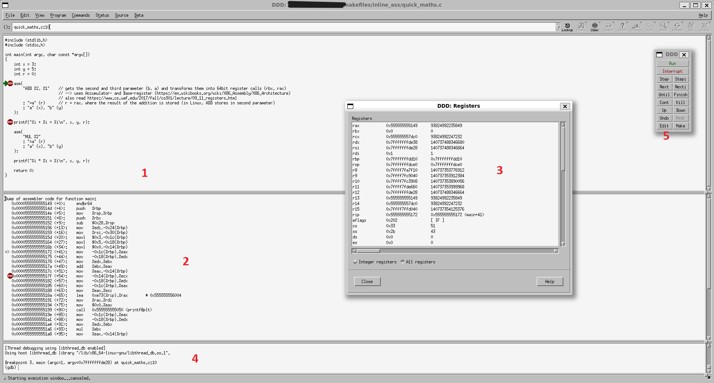

# Aufzeichnungen und Programme aus Intel (Günther)

## Inhaltsverzeichnis

- [Inhaltsverzeichnis](#inhaltsverzeichnis)
- [Programme](#programme)
- [Aufzeichnungen Semester 4](#aufzeichnungen-semester-4)
  - [Architektur](#architektur)
  - [Linking](#linking)
  - [Makefile](#makefile)
  - [Bedeutung des '=' bei C/asm/Deklaration\_Ausgabeparameter](#bedeutung-des--bei-casmdeklaration_ausgabeparameter)
  - [Data Display Debugger](#data-display-debugger)
  - [ABI - Application Binary Interface](#abi---application-binary-interface)
  - [Zwei Arten von (x86) Assembler Syntaxen](#zwei-arten-von-x86-assembler-syntaxen)
- [Aufzeichnungen Semester 5](#aufzeichnungen-semester-5)
  - [Das Philosophenproblem](#das-philosophenproblem)
    - [Problem](#problem)
    - [Lösungsmöglichkeiten](#lösungsmöglichkeiten)
    - [Praxisbeispiel](#praxisbeispiel)
  - [Interprozesskommunikation](#interprozesskommunikation)
    - [Signale](#signale)
    - [fork - Prozesse klonen](#fork---prozesse-klonen)
- [Diverse Kommandos und Befehle](#diverse-kommandos-und-befehle)
  - [Linux Kommandos](#linux-kommandos)
  - [Assembler Befehle](#assembler-befehle)
- [TODO](#todo)
- [HA](#ha)

## Programme

Die Programme sortiert nach ihrem Behandlungsdatum:

Semester 4:

1. [greet_anton](greet_anton/)
2. [greetings](greetings/)
3. [ass_hello](ass_hello/)
4. [inline_ass](inline_ass/)
5. [count_ones](count_ones/)
6. [call_ass_from_c](call_ass_from_c/)
7. [call_ass_from_c_32](call_ass_from_c_32/)

Semester 5:

1. [hello](hello/)
2. [active_wait](active_wait/)

Um die Projekte mit 32 Bit Architektur nutzen zu können, kann es notwendig sein, die Bibliothek *gcc-multilib* mit dem entsprechenden Paketmanager zu installieren.
Die Programme unter 'models' sind von der Website [opensource.com](https://opensource.com/article/18/8/what-how-makefile) (Author: Sachin Patil)
inspirierte Vorlagen für Makefiles von C Programmen. Erstere sind wiederum Ausgangsbasis für die oben genannten Programme,
weswegen dieses Projekt insgesamt der ursprünglichen Lizenz [CC BY-SA 4.0](https://creativecommons.org/licenses/by-sa/4.0/) unterstellt ist.

## Aufzeichnungen Semester 4

mithilfe des 'file' Befehls können Metainformationen einer Datei abgefragt werden, bspw.:

### Architektur

Heutzutage nutzen Prozessoren eine 64 Bit Architektur. Dies bedeutet das 64 Bit Zahlen und Befehle verarbeitet werden.

### Linking

- statisches Linking: Der gesamte Code des Programms befindet sich in der Datei
  - Nützlich, wenn das Programm auf einem minimalen Linux (bspw. Auto) laufen soll
- dynamisches Linking: In dem Code des Programms finden sich Verweise auf externe Bibliotheken

### Makefile

Eine Datei, die von dem Programm Make verwendet werden kann. Dieses wird normalerweise dazu verwendet den Compilierungsprozess zu automatisieren.
Vorteile: bedarfkonforme Compilierung, Parallelisierung

### Bedeutung des '=' bei C/asm/Deklaration_Ausgabeparameter

von [gnu.gcc.org](https://gcc.gnu.org/onlinedocs/gcc/extensions-to-the-c-language-family/how-to-use-inline-assembly-language-in-c-code.html#outputoperands)  
> Output constraints must begin with either = (**a variable overwriting an existing value**) or + (when reading and writing).
> When using =, do not assume the location contains the existing value on entry to the asm, except when the operand is tied to an input; see Input Operands.

### Data Display Debugger

von [wikipedia.org](https://de.wikipedia.org/wiki/Data_Display_Debugger)  
> Der Data Display Debugger ist ein quell-offenes, grafisches Frontend für kommandozeilen-basierte Debugger und Teil des GNU-Projekts.
> Zweck von DDD ist es, die Fehlersuche in Programmen zu erleichtern, indem Datenstrukturen grafisch dargestellt werden.
> Dabei ist DDD selbst kein Debugger, sondern benötigt immer einen untergeordneten Debugger wie GDB, DBX oder XDB.
>
> DDD eignet sich nicht nur zum Debuggen kompilierter Programme, sondern auch für interpretierte Sprachen wie Python, Perl oder Bash.
> Das breiteste Funktionsspektrum bietet DDD in Verbindung mit dem GNU Debugger, GDB.
>
>[...]
>
> Mit dem DDD kann man zum Beispiel Quellcode-Zeilen und grafisch aufbereitete Daten betrachten, wobei Datenstrukturen als Diagramme angezeigt werden.
> Mit einem Mausklick können Zeiger dereferenziert oder Inhalte von Strukturen dargestellt werden, die jedes Mal aktualisiert werden, wenn das Programm angehalten wird.

Nutzung des DDD am Beispielprogramm [inline_ass](inline_ass)  
  
1 - C Programmcode. Hier können Breakpoints eingefügt werden, bei denen beim Durchlaufen angehalten wird.  
2 - Assembler Code. Hier werden die übersetzten Maschinenanweisungen des C Codes auszugsweise (kurz vor bis kurz nach dem aktuellen Breakpoint) angezeigt.  
3 - Registeranzeige. Zeigt die aktuellen Zustände der CPU Register.  
4 - GDB Konsole. Ermöglicht direkt Befehle an den GDB zu richten.  
5 - DDD Steuerung. Beinhaltet Buttons zur Steuerung des Debugprozesses.  

### ABI - Application Binary Interface

ABIs, auch Binärschnittstellen sind Schnittstellen zwischen Programmen auf Maschinenebene.
Sie definieren Spezifikationen für den Programmcode, damit dieser die Schnittstelle nutzen kann.
Über solche Schnittstellen werden Beispielsweise externe Bibliotheken in Programme eingebunden. \
Für x86 Prozessoren gibt es eine definierte ABI, die durch folgende [Aufrufkonvention](call_convention.md) definiert ist.

### Zwei Arten von (x86) Assembler Syntaxen

| AT&T (beheimatet bei Unix)                                                                                | Intel (beheimatet bei Windows)                                                                            |
| :-------------------------------------------------------------------------------------------------------- | :-------------------------------------------------------------------------------------------------------- |
| source (Eingabewert) vor destination (Zieladdresse)                                                         | destination (Zieladdresse) vor source (Eingabewert)                                                         |
| unterschiedliche Speichergrößen der Parameter werden durch einen Zusatzbuchstaben am Befehl differenziert | unterschiedliche Speichergrößen der Parameter werden implizit über die übergebenen Register differenziert |

## Aufzeichnungen Semester 5

### Das Philosophenproblem

#### Problem

Fünf Philosophen sitzen an einem Tisch und wollen eine schwierige Sorte
Spaghetti essen.
Dafür brauch ein jeder zwingend zwei Gabeln. Zwischen je zwei Philosophen
liegt je eine Gabel, also insgesamt fünf am Tisch.

Nach Wikipedia
([de.wikipedia.org](https://de.wikipedia.org/wiki/Philosophenproblem#Problem)):

    Die Philosophen sitzen am Tisch und denken über philosophische Probleme
    nach. Wenn einer hungrig wird, greift er zuerst die Gabel links von seinem
    Teller, dann die auf der rechten Seite und beginnt zu essen. Wenn er satt
    ist, legt er die Gabeln wieder zurück und beginnt wieder zu denken. Sollte
    eine Gabel nicht an ihrem Platz liegen, wenn der Philosoph sie aufnehmen
    möchte, so wartet er, bis die Gabel wieder verfügbar ist.

    Solange nur einzelne Philosophen hungrig sind, funktioniert dieses
    Verfahren. Es kann aber passieren, dass sich alle fünf Philosophen
    gleichzeitig entschließen, zu essen. Sie ergreifen also alle gleichzeitig
    ihre linke Gabel und nehmen damit dem jeweils links von ihnen sitzenden
    Kollegen dessen rechte Gabel weg. Nun warten alle fünf darauf, dass die
    rechte Gabel wieder auftaucht. Das passiert aber nicht, da keiner der fünf
    seine linke Gabel zurücklegt. Die Philosophen verhungern.

#### Lösungsmöglichkeiten

- gegenseitige Absprache
- Priorisierung
- Nummerierung und intelligente Nutzung der Ressourcen

#### Praxisbeispiel

- Es gibt 5 Prozesse: A, B, C, D, E.
- Es gibt 4 CPU-Kerne.
- Ein Prozess dauert 1 min.
- Ein Prozess kann unterbrochen werden.

Wie lange dauert die parallele Abarbeitung der fünf Prozesse (ohne Overhead)?

Antwort: 1,25 min

### Interprozesskommunikation

#### Signale

Mithilfe des Kommandos `kill` können verschiedene Signal an Prozesse gesendet
werden. Mit dem Signal SIGKILL (Standard) kann so zum Beispiel ein Prozess
aufgefordert werden, sich zu beenden, während mit SIGSTOP und anschließendem
SIGCONT ein Prozess angehalten und wieder gestartet werden kann.

#### fork - Prozesse klonen

Fork ist ein Kommando, das einen bestehenden Prozess vollständig kopiert.
Dabei gibt der Rückgabewert auskunft dass:

- ich der Elternprozess bin und welche PID mein Kind hat (>0)
- ich der Kindprozess bin (=0)
- das kopieren Fehlgeschlagen ist, z.B. aufgrund fehlender Ressourcen (<0)

## Diverse Kommandos und Befehle

### Linux Kommandos

- cd
- ls
- gcc
- htop
- mcedit
- ps
- cp
- chmod / chown
- kate
- nano
- time
- sed
- bash
- make
- sudo
- vi
- cat
- ssh
- kill
- lolcat

### Assembler Befehle

- [call](https://c9x.me/x86/html/file_module_x86_id_26.html)
- [ret](https://c9x.me/x86/html/file_module_x86_id_280.html)
- lea

## TODO

Fork, Pipe, Select, Semaphor, Deadlock
UDP, TCP

## HA

semget() semctl() semop()
<<<<<<< HEAD

Übung in der zwei Prozesse (fork) mit zufälligem zeitlichen Abstand V (Vater) bzw. s (Sohn) auf stdout schreiben.
Anschließend synchronisieren mit Semaphore, sodass abwechselnd je zwei Zeichen (V/ s) auf stdout erscheinen.
Semaphore sollen abschaltbar gemacht sein.
=======
>>>>>>> de55fb7 (lesson of 10.10.24)
