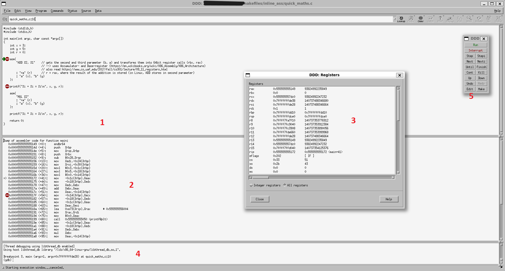

# Aufzeichnungen und Programme aus Intel (Günther)

## Programme

Die Programme sortiert nach ihrem Behandlungsdatum:

1. greet_anton
2. greetings
3. ass_hello
4. inline_ass
5. count_ones

Die Programme unter 'models' sind von der Website [opensource.com](https://opensource.com/article/18/8/what-how-makefile) (Author: Sachin Patil) inspirierte Vorlagen für Makefiles von C Programmen. Erstere sind wiederum Ausgangsbasis für die oben genannten Programme, weswegen dieses Projekt insgesamt der ursprünglichen Lizenz [CC BY-SA 4.0](https://creativecommons.org/licenses/by-sa/4.0/) unterstellt ist.

## Aufzeichnungen

mithilfe des 'file' Befehls können Metainformationen einer Datei abgefragt werden, bspw.:

### Architektur

Heutzutage nutzen Prozessoren eine 64 Bit Architektur. Dies bedeutet das 64 Bit Zahlen und Befehle verarbeitet werden.

### Linking

- statisches Linking: Der gesamte Code des Programms befindet sich in der Datei
  - Nützlich, wenn das Programm auf einem minimalen Linux (bspw. Auto) laufen soll
- dynamisches Linking: In dem Code des Programms finden sich Verweise auf externe Bibliotheken

### Bedeutung des '=' bei C/asm/Deklaration_Ausgabeparameter

von [gnu.gcc.org](https://gcc.gnu.org/onlinedocs/gcc/extensions-to-the-c-language-family/how-to-use-inline-assembly-language-in-c-code.html#outputoperands)  
> Output constraints must begin with either = (**a variable overwriting an existing value**) or + (when reading and writing). When using =, do not assume the location contains the existing value on entry to the asm, except when the operand is tied to an input; see Input Operands.

### Data Display Debugger

von [wikipedia.org](https://de.wikipedia.org/wiki/Data_Display_Debugger)  
> Der Data Display Debugger ist ein quell-offenes, grafisches Frontend für kommandozeilen-basierte Debugger und Teil des GNU-Projekts. Zweck von DDD ist es, die Fehlersuche in Programmen zu erleichtern, indem Datenstrukturen grafisch dargestellt werden. Dabei ist DDD selbst kein Debugger, sondern benötigt immer einen untergeordneten Debugger wie GDB, DBX oder XDB.
>
> DDD eignet sich nicht nur zum Debuggen kompilierter Programme, sondern auch für interpretierte Sprachen wie Python, Perl oder Bash. Das breiteste Funktionsspektrum bietet DDD in Verbindung mit dem GNU Debugger, GDB.
>
>[...]
>
> Mit dem DDD kann man zum Beispiel Quellcode-Zeilen und grafisch aufbereitete Daten betrachten, wobei Datenstrukturen als Diagramme angezeigt werden. Mit einem Mausklick können Zeiger dereferenziert oder Inhalte von Strukturen dargestellt werden, die jedes Mal aktualisiert werden, wenn das Programm angehalten wird.

Nutzung des DDD am Beispielprogramm [inline_ass](inline_ass)  
  
1 - C Programmcode. Hier können Breakpoints eingefügt werden, bei denen beim Durchlaufen angehalten wird.  
2 - Assembler Code. Hier werden die übersetzten Maschinenanweisungen des C Codes auszugsweise (kurz vor bis kurz nach dem aktuellen Breakpoint) angezeigt.  
3 - Registeranzeige. Zeigt die aktuellen Zustände der CPU Register.  
4 - GDB Konsole. Ermöglicht direkt Befehle an den GDB zu richten.  
5 - DDD Steuerung. Beinhaltet Buttons zur Steuerung des Debugprozesses.  

### ABI - Application Binary Interface

ABIs, auch Binärschnittstellen sind Schnittstellen zwischen Programmen auf Maschinenebene. Sie definieren Spezifikationen für den Programmcode, damit dieser die Schnittstelle nutzen kann. Über solche Schnittstellen werden Beispielsweise externe Bibliotheken in Programme eingebunden.  
Für x86 Prozessoren gibt es eine definierte ABI, die durch folgende [Aufrufkonvention](call_convention.md) definiert ist.

### HA

lea, [call](https://c9x.me/x86/html/file_module_x86_id_26.html), [ret](https://c9x.me/x86/html/file_module_x86_id_280.html)
